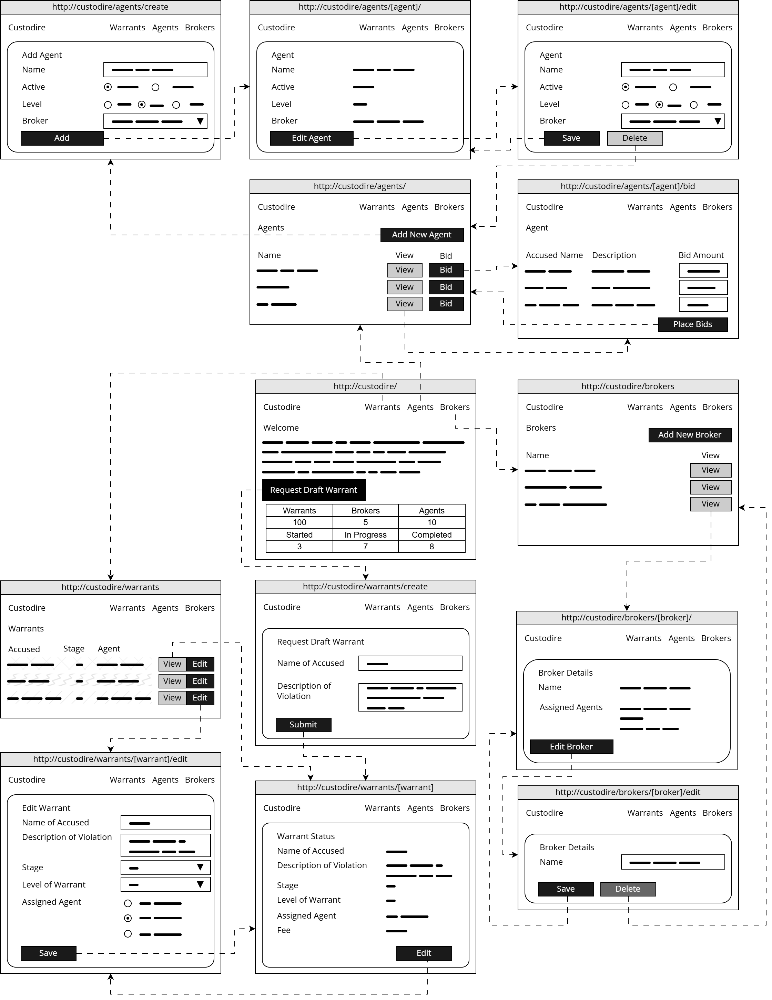

# Framework Project Examen

| Vak        | Framework Project 1                  |
|------------|--------------------------------------|
| Code       | CU75080V3                            |
| Datum      | OEFENEXAMEN                          |
| Tijd       | OEFENEXAMEN                          |
| Duur       | 180 minuten (+extra)                 |
| Inlevering | Inleveren via Athena (exam.hboict.hz.nl) |

**In geval van enige discrepantie tussen de Engelse en Nederlandse versie van de instructies, wordt de Engelse versie beschouwd als leidend.**

### Instructies
 - Lees de vereisten voor de oplossing, beginnend op de volgende pagina.
 - Download en laad de startomgeving van Athena.
 - Maak je implementatie conform de vereisten.
 - Start de server door `php maestro serve` in de terminal uit te voeren.
   - Je kunt de applicatie bereiken via `http://localhost:8888` in je browser.

### Toegestaan
 - Je mag alleen je eigen toegewezen computer gebruiken.
 - Op je computer mag je alleen PHPStorm gebruiken voor ontwikkeling en je browser voor testen.
 - Je mag alleen Athena (portal voor het inleveren van toetsen) gebruiken.
 - Je mag alleen de opgegeven starterscode en -bestanden gebruiken.

### NIET Toegestaan
 - Je mag geen gebruik maken van fysieke of digitale bronnen (inclusief boeken, aantekeningen, codefragmenten, eerdere toetsen of opdrachten) die lokaal of op afstand zijn opgeslagen, internetbronnen (voor referentie, communicatie, creatie en/of bewerking), communicatieapparaten (inclusief mobiele telefoons, smartwatches en hoofdtelefoons), menselijke hulp (verbaal, schriftelijk en/of via gebaren), en/of enige vorm van kunstmatige intelligentie of geautomatiseerde hulp (inclusief, maar niet beperkt tot Copilot en ChatGPT). Eventuele onduidelijkheden dienen vóór aanvang te worden verduidelijkt met de examinator of surveillant.
 - Je mag geen hulp verlenen of proberen te verlenen (verbaal, schriftelijk en/of via gebaren) aan anderen.

### Inlevering
 - Je moet inleveren via Athena.
 - Maak één enkel .zip-bestand dat **alleen** je `app`- en `database`-mappen bevat.
 - Lever het .zip-bestand in via Athena.
 - Je mag tijdens het examen meerdere keren inleveren.
 - De laatste code die je hebt ingeleverd, wordt beschouwd als je definitieve inleveren en zal worden beoordeeld.

# Custodire

## Systeemcontext
De Suppuratio heeft het volledige private beheer over alle regeringen van de aarde overgenomen. Wat begon als een verzameling van de sociale-mediabedrijven van weleer, is de Suppuratio inmiddels uitgegroeid tot een hardnekkige megacorporatie. Velen zagen het aankomen, sommigen juichten het toe, en uiteindelijk gaf de hebzucht van overheden de ultieme controle over aan de Suppuratio. Sindsdien heeft de Suppuratio de controle overgenomen over kritieke infrastructuur, productie en de openbare orde via hun "Vertrouwens- en Veiligheidscomité" (Trust and Safety Committee), ook bekend als De Venalis.

Om hun controle te behouden, heeft de Suppuratio een systeem van "Dwangbevelen" geïmplementeerd. Dwangbevelen worden opgesteld tegen personen die worden beschuldigd van misdaden of overtredingen van de algemene voorwaarden van de samenleving. Iedereen kan een klacht indienen tegen een andere persoon, en als de klacht door De Venalis als geldig wordt beschouwd, wordt er een Dwangbevel afgegeven tegen de beschuldigde.

Dwangbevelen worden uitgevoerd door Bevelagenten, die worden beheerd door Bevelmakelaars. De Bevelagenten zijn verantwoordelijk voor de uitvoering van de Dwangbevelen, die kunnen variëren van detentie tot eliminatie. De Bevelmakelaars zijn verantwoordelijk voor het beheren van de Agenten en het bieden op de Dwangbevelen.

### Bedrijfsproces
Een Aanklager doet een aangifte bij een Vertrouwens- en Veiligheidscentrum. Vervolgens wordt er een Dwangbevel opgesteld tegen de beschuldigde; de aangifte gaat naar De Venalis, die de geldigheid van de klacht zal bepalen. Als zij de klacht geldig achten, kunnen zij het Dwangbevel afgeven. Er zijn drie niveaus van Dwangbevelen:
 1. Detentie,
 2. Onopzettelijk letsel,
 3. en Onmiddellijke Eliminatie.

Elke Bevelagent is toegewezen aan een Makelaar die zal bieden op de Dwangbevelen die de Agenten moeten uitvoeren. Elke Bevelagent heeft een specifiek niveau, en Dwangbevelen kunnen alleen worden toegewezen aan Agenten met hetzelfde of een hoger niveau.

De fasen van een Dwangbevel zijn als volgt:
 1. **Concept:** Er is een klacht ingediend en een Dwangbevel is opgesteld, maar het is nog niet afgeven.
 2. **Afgeven:** Het Dwangbevel heeft een niveau afgegeven gekregen van De Venalis en is nu beschikbaar voor bieden door Bevelagenten.
 3. **Bieden:** Zodra er één bod is uitgebracht op het Dwangbevel, gaat het over naar de biedfase.
 4. **Toegewezen:** Het Dwangbevel is toegewezen aan een Bevelagent. Bieden is gesloten.
 5. **Voltooid:** Het Dwangbevel is voltooid door de toegewezen Agent.
 6. **Geannuleerd:** Het Dwangbevel is geannuleerd door De Venalis. Er kan geen verdere actie worden ondernomen op het Dwangbevel.

Wanneer een Dwangbevel is afgeven, kunnen alle Bevelmakelaars beginnen met bieden op het Dwangbevel. Makelaars bieden namens de Agenten die zij beheren. Ze kunnen één of meer van hun Bevelagenten bieden, evenals de vergoeding waartegen de Agent het Dwangbevel zal uitvoeren.

Na het bieden zal De Venalis het Dwangbevel toewijzen aan de Agent. Dit hoeft niet per se de Agent met het hoogste bod te zijn. Het Dwangbevel wordt vervolgens gemarkeerd als "toegewezen". Zodra de Agent het Dwangbevel heeft voltooid, zal De Venalis het markeren als "voltooid". De Venalis kan een Dwangbevel op elk moment annuleren, waardoor het wordt gemarkeerd als "geannuleerd" en er geen verdere actie op kan worden ondernomen.

## Instructies
Bouw een webapplicatie met het Maestro-framework die de volgende functionele en niet-functionele vereisten voor het Custodire-systeem implementeert. Er is een gedeeltelijke implementatie van het systeem beschikbaar. Je moet een geschikt datamodel ontwerpen en de ontbrekende functionaliteit implementeren.

### Functionele Vereisten
- Makelaars moeten worden beheerd, inclusief het aanmaken, bewerken en verwijderen van makelaars. Elke makelaar heeft een naam.

- Bij het bekijken van een makelaar moet ook een lijst van al hun agenten worden weergegeven.

- Agenten moeten worden beheerd, inclusief het aanmaken, bewerken en verwijderen van agenten. Elke agent heeft een naam, een status (actief/inactief) en een niveau (1-3), evenals een toegewezen makelaar.

- Aanklagers moeten in staat zijn om conceptdwangbevelen aan te vragen. Conceptdwangbevelen bevatten de naam van de beschuldigde en een beschrijving van de vermeende overtreding. Er kan slechts één conceptdwangbevel tegelijk worden opgesteld tegen een beschuldigde.

- Een lijst van alle dwangbevelen moet worden weergegeven in een tabelformaat. Het moet de naam van de beschuldigde, de beschrijving en de fase van het dwangbevel bevatten. De rij van elk dwangbevel moet kleurgecodeerd zijn op basis van het niveau van het dwangbevel:
  - Niveau 1: Groen
  - Niveau 2: Oranje
  - Niveau 3: Rood

- Het bekijken van het dwangbevel toont meer details, inclusief het nivea van het dwangbevel, de toegewezen agent en het winnende bod (indien van toepassing).

- Bij het bewerken van een dwangbevel kan het niveau van het dwangbevel worden toegewezen en kan de fase van het dwangbevel worden bijgewerkt. De fase van het dwangbevel kan handmatig alleen worden bijgewerkt naar "afgeven", "voltooid" of "geannuleerd". Andere fasen worden automatisch bijgewerkt.

- Om op een dwangbevel te bieden, wordt vanuit de agentenlijst een lijst weergegeven van alle afgegeven dwangbevelen die voldoen aan het niveau van de agent. De makelaar kan vervolgens een biedingsbedrag invoeren voor elk dwangbevel. De fase van het dwangbevel wordt bijgewerkt naar "bieden" zodra er een bod op is uitgebracht.

- Zodra er biedingen zijn gedaan, kan een agent worden toegewezen aan het bevel. Bij het bewerken van het bevel wordt een lijst weergegeven van alle agenten die een actief bod hebben op het bevel. Een agent kan vervolgens worden toegewezen aan het bevel, waardoor de fase van het bevel wordt bijgewerkt naar "toegewezen".

- Dwangbevelen kunnen niet worden verwijderd. Als de aan het bevel toegewezen agent wordt verwijderd, moet het bevel worden ontkoppeld.

- De startpagina moet een dashboard weergeven met de volgende informatie:
  - Totaal aantal dwangbevelen, makelaars en agenten
  - Subtotalen van dwangbevelen in de volgende fasecategorieën:
    - Gestart: concept, afgeven, bieden
    - In Behandeling: toegewezen
    - Gesloten: voltooid, geannuleerd

### Niet-Functionele Vereisten
- PHP-codestijl moet consistent zijn met PSR-12.

- Statische codeanalyse moet worden uitgevoerd op PHPStan niveau 8.

- De webapplicatie moet worden ontworpen en geïmplementeerd volgens gevestigde software-engineeringprincipes, waaronder een goed databaseontwerp.

- Bewerking van gegevens moet worden gedaan met behulp van het repository pattern.

- Het functionele ontwerp van de applicatie moet overeenkomen met de meegeleverde wireflow.

- De gebruikersinterface moet overzichtelijk en intuïtief zijn, met duidelijke navigatie en consistente stijl, en validatie en foutafhandeling bieden voor gebruikersinvoer.

## Voorbeelddataset
Hieronder staat een voorbeelddataset die de vereisten van het systeem illustreert. Een Excel-bestand met een uitgebreidere versie van deze dataset is beschikbaar in de map `docs`. Je kunt deze dataset gebruiken om je implementatie te testen, maar je bent niet verplicht deze exacte gegevens te gebruiken.

> Dit zijn alleen voorbeeldgegevens ter illustratie van de vereisten. Je hoeft deze exacte gegevens niet te gebruiken, maar je implementatie moet vergelijkbare gegevens kunnen ondersteunen.

| Makelaar      | Agent      | Actief | Niveau | Naam 1       | Aangifte 1                                         | Niveau 1 | Fase 1      | Bod 1 | Naam 2       | Aangifte 2                                         | Niveau 2 | Fase 2    | Bod 2 |
|---------------|------------|--------|--------|--------------|----------------------------------------------------|---------------|-------------|------------------|--------------|---------------------------------------------------|---------------|-----------|------------------|
| Father Caelum | Jax Calder | TRUE   | 3      | Aaron Blight | Speelde ongeautoriseerde muziek                    | 2             | Toegewezen  | 19900            | The Tinman   | Kwetste de gevoelens van de aanklager                | 3             | Voltooid  | 38000            |
|               | Rowan Pike | TRUE   | 3      | Liesel Korr  | Volgde de vereiste boetedoening voor woorden niet  | 2             | Toegewezen  | 13800            | Marcus Yew   | Hield zich niet aan de minimale dagelijkse schermtijd | 2          | Bieden    | 15000            |
| Rodere Rex    | Tomás Redd | TRUE   | 2      | Petra Lin    | Gebruikte een advertentieblokker                   | 1             | Voltooid    | 26500            |              |                                                   |               |           |                  |
|               | Briar Holt | TRUE   | 2      | Marcus Yew   | Hield zich niet aan de minimale dagelijkse schermtijd | 2          | Bieden      | 22700            | Samuel Oakes | Gebruikte een LLM                     | 1             | Voltooid  | 11600            |

### Wireflow
De onderstaande wireflow illustreert de verwachte werking van de applicatie. Het toont alleen de **primaire flows** en niet de alternatieve of uitzonderlijke (exception) flows.

> Deze wireflow is bedoeld als leidraad om de verwachte werking van de applicatie te illustreren. Je hoeft de applicatie niet exact te ontwerpen zoals weergegeven, maar je implementatie moet overeenkomen met de in de wireflow geïllustreerde flow.

# Beoordeling

Er kan maximaal **100 punten** worden toegekend. Een voorlopige cesuur van **60 punten** wordt gehanteerd.

## Beoordelingscriteria
PHP moet worden uitgevoerd zonder Fatal foutmeldingen.

## Beoordelingscriteria

### Codekwaliteit & Stijl [20]
 - Codekwaliteit wordt getest met PHPCS conform PSR-12-coderingsnormen en PHPStan conform niveau 8-regels.
 - Elke gevonden overtreding resulteert in een aftrek van punten, tot een maximum van 20 punten.
   - Elke PHPCS-overtreding trekt 0,5 punt af.
   - Elke PHPStan-overtreding trekt 1 punt af.
 - De codekwaliteitsbeoordeling kan worden overschreven door de beoordelaar.

> **HINT**: Je kunt `php maestro phpcs` uitvoeren om te controleren op PHPCS-problemen, en `php maestro phpstan` om te controleren op PHPStan-problemen.

### Dataopslag [30]
 - Databaseontwerp: Tabellen moeten correct zijn genormaliseerd met geschikte datatypes, juiste relaties en zinvolle constraints.
 - Repository-patroon: Repositories zijn het enige toegangspunt voor gegevens, wat zorgt voor een duidelijke scheiding van verantwoordelijkheden met duidelijke methoden.
 - SQL-query's: Query's moeten correct, efficiënt en veilig zijn, gebruikmakend van prepared statements en het vermijden van onnodige complexiteit of duplicatie.

### Applicatielogica [40]
 - Vereisten & Correctheid: Vereiste functies zijn volledig geïmplementeerd en gedragen zich correct volgens de functionele vereisten, inclusief een juiste afhandeling van randgevallen en ongeldige invoer.
 - Controllers & Scheiding van Verantwoordelijkheden: Controllers gericht op verzoekafhandeling, gegevenstoegang naar de juiste lagen.
 - Architectuur & Ontwerppatronen: Volgen van de beoogde architectuur en ontwerppatronen die onderhoudbaarheid, uitbreidbaarheid en lage koppeling bevorderen.

### Gebruikerservaring [10]
 - Wireflow & UI-samenhang: De gebruikersinterface moet de meegeleverde wireflow volgen, met consistente lay-out, navigatie en interactiepatronen door de gehele applicatie.
 - Validatie & Foutafhandeling: Gebruikersinvoer moet duidelijk worden gevalideerd met zinvolle feedback.

### Architectuurcorrectie [-20]
Als de MVC-architectuur met een juiste scheiding van verantwoordelijkheden, inclusief het repositorypatroon, niet wordt gevolgd, kan er een correctie van maximaal 20 punten worden toegepast.

> **HINT**: Je kunt `php maestro deptrac` uitvoeren om te controleren op architectuurproblemen.

# Credits
 - Thema: vapor (https://bootswatch.com)
 - Lettertypen: Orbitron (https://fonts.google.com/specimen/Orbitron)